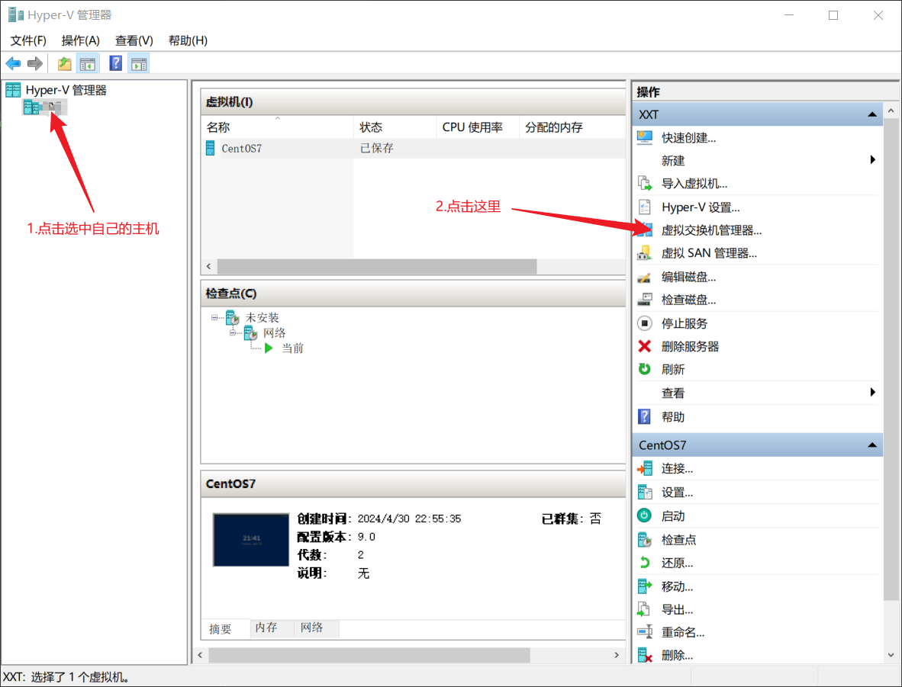
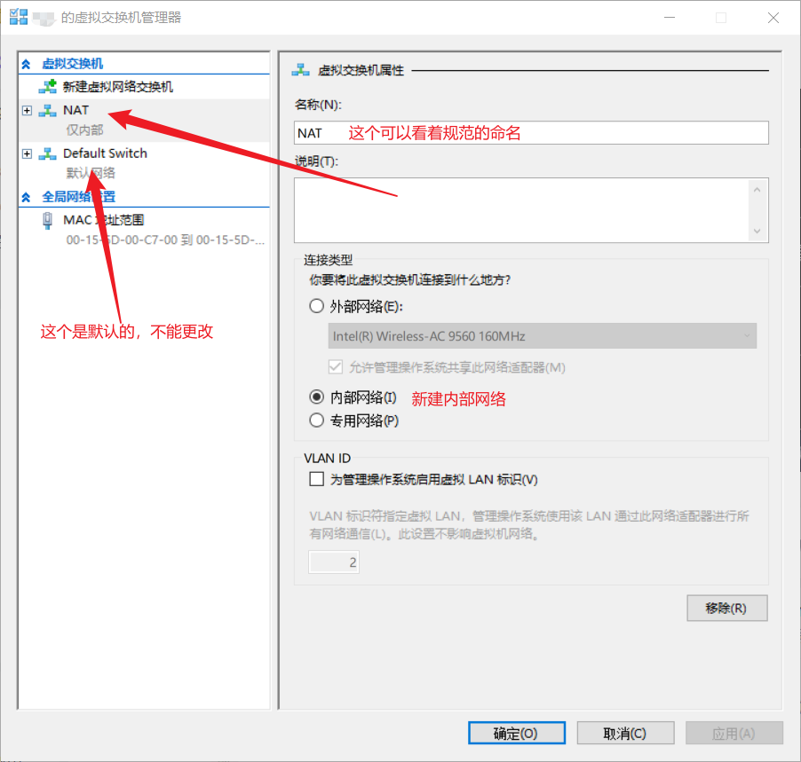
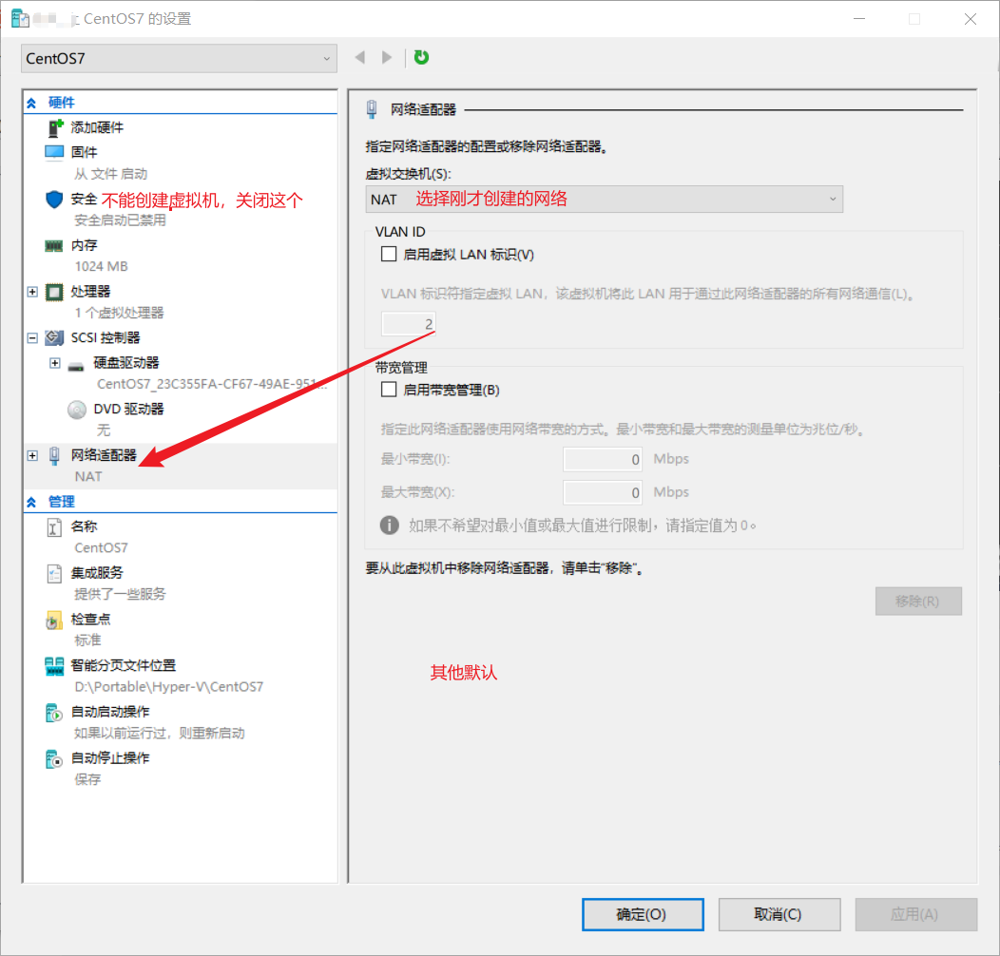
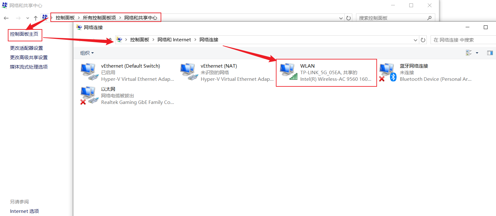
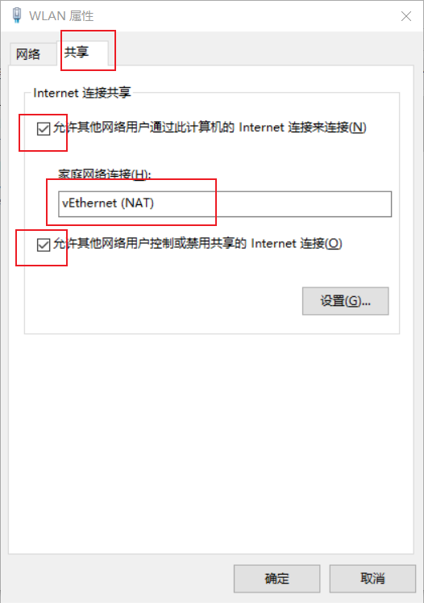
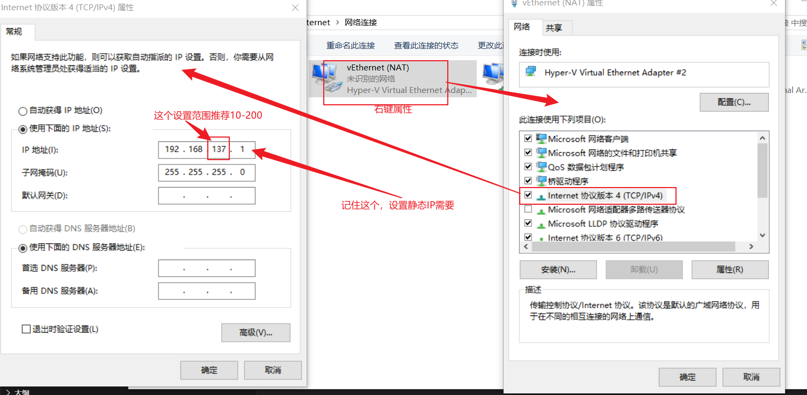

# CentOS7

## 下载OS

    这个应该没有啥问题吧

## 设置Hyper-V NAT网络

### 开启Hyper-V，不做介绍

    如果后面有需要再补充

### NAT网络

- 在Hyper-V上的设置








- 设置网络



右键，属性，共享



- 配置静态IP（CentOS安装完成后设置）



刚才设置的IP是192.168.137.1

CentOS安装完成后

使用Hyper-V创建的CentOS虚拟机的网卡应该是ifcfg-eth0

```bash
# 使用管理员权限
sudo vim /etc/sysconfig/network-scripts/ifcfg-eth0
```

```bash
# 修改下面的
BOOTPROTO="static"
ONBOOT="yes"                #开机启用本配置
# 新增                                 
IPADDR=192.168.137.110      #静态IP
GATEWAY=192.168.137.1       #默认网关
NETMASK=255.255.255.0       #子网掩码
DNS1=192.168.137.1          #DNS地址1
DNS2=114.114.114.114        #DNS地址2
```

## 安装选择GUI桌面的


