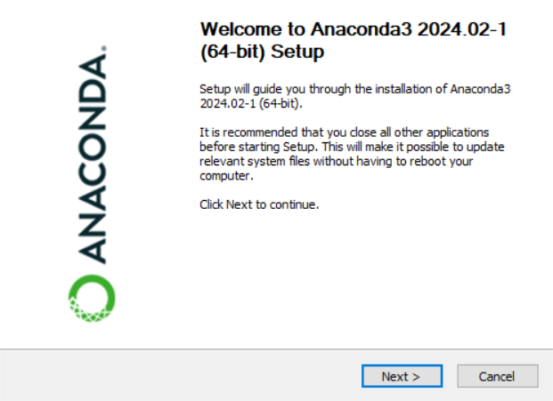
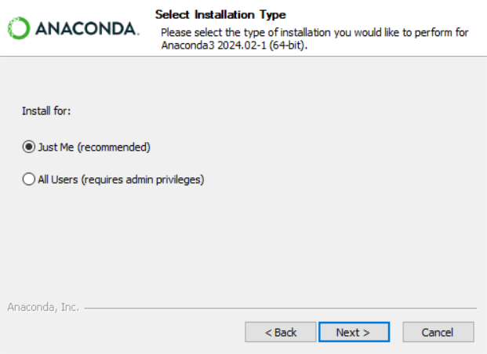
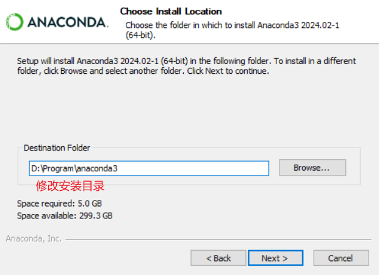
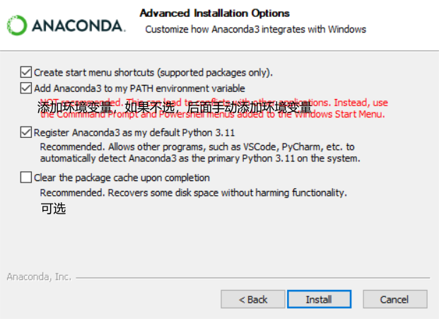
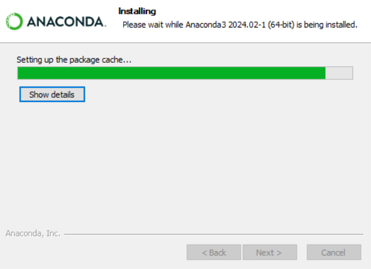
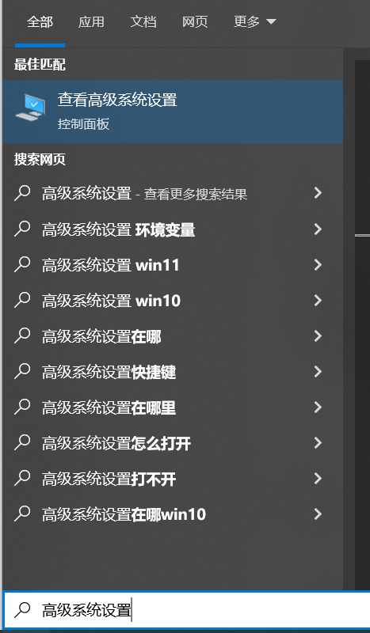
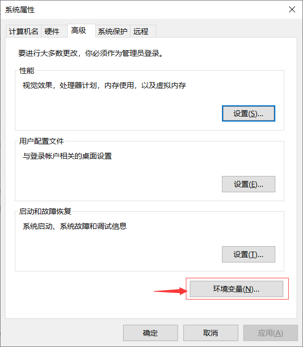
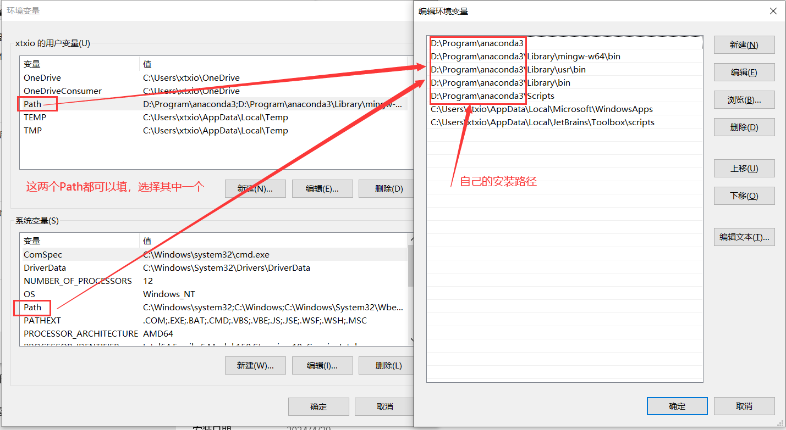

# Anaconda下载安装

## 下载

- [官网链接](https://www.anaconda.com/download/success)
- [清华镜像](https://mirrors.tuna.tsinghua.edu.cn/anaconda/archive/)
- [其他](https://help.mirrors.cernet.edu.cn/anaconda/)

## 安装

- 双击安装包,Next

  

- 协议，I Agree，

  
- 一般个人电脑选择第一个，Just Me

  
- 选择安装目录

  
- 前三个全部勾选，第四个可选

  
- 等待安装结束

  
- 安装完成

  

# Anaconda配置

## 环境变量

- 设置环境变量
      
    
    


## 修改镜像源

镜像站提供了 Anaconda 仓库与第三方源（conda-forge、msys2、pytorch 等，各镜像站镜像的第三方源并不相同，可以参考下方「第三方镜像源」一节）的镜像，各系统都可以通过修改用户目录下的 .condarc 文件来使用镜像站。

不同系统下的.condarc目录如下：

- Linux: ${HOME}/.condarc
- macOS: ${HOME}/.condarc
- Windows: C:\Users\\\<YourUserName>\\\.condarc

注：

- Windows 用户无法直接创建名为 .condarc 的文件，可先执行 conda config --set show_channel_urls yes 生成该文件之后再修改。
- 由于更新过快难以同步，TUNA 等镜像站不同步pytorch-nightly, pytorch-nightly-cpu, ignite-nightly这三个包。
- 如果您正在从某一镜像源切换到另一镜像源，请检查镜像源是否同步了您所需要的 repo，以及该 repo 是否支持您使用的平台 (e.g. linux-64)。
- 为了保证以下配置在所有镜像站可用，配置中只加入了少量必须的第三方源，您可以在下方的列表中自行寻找并添加其他第三方源。

### 修改.condarc文件
    
```
channels:
  - defaults
show_channel_urls: true
default_channels:
  - https://mirrors.tuna.tsinghua.edu.cn/anaconda/pkgs/main
  - https://mirrors.tuna.tsinghua.edu.cn/anaconda/pkgs/r
  - https://mirrors.tuna.tsinghua.edu.cn/anaconda/pkgs/msys2
custom_channels:
  conda-forge: https://mirrors.tuna.tsinghua.edu.cn/anaconda/cloud
  pytorch: https://mirrors.tuna.tsinghua.edu.cn/anaconda/cloud
```

### 第三方源列表(在命令行添加)
    conda config --set custom_channels.conda-forge https://mirrors.tuna.tsinghua.edu.cn/anaconda/cloud/

    运行 conda clean -i 清除索引缓存，保证用的是镜像站提供的索引。

### Pypi

```pip
pip config set global.index-url https://pypi.tuna.tsinghua.edu.cn/simple
```